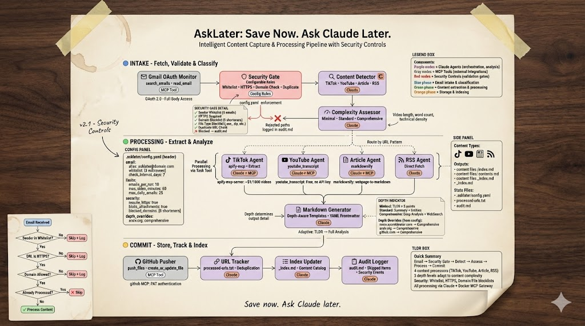

# AskLater

**Save now. Ask Claude later.**

An intelligent content aggregation system that processes content you share via email, automatically summarizing and storing it as searchable markdown for later querying with Claude.



## The Problem

You're constantly bombarded with valuable content - TikToks, YouTube videos, articles, newsletters. You save them "for later" but:
- No time to process in the moment
- Bookmarks become a graveyard
- By the time you return, context is lost
- "I saw something about this but can't remember where"

## The Solution

Forward any content to your AskLater email alias. Claude processes it automatically:

1. **Send** - Forward/share content to `asklater@yourdomain.com`
2. **Process** - Claude extracts, summarizes, and tags the content
3. **Store** - Markdown files committed to your repo with full metadata
4. **Query** - Ask Claude about your knowledge base anytime

## How It Works

### Phase 1: Intake
- Gmail OAuth monitors your AskLater alias
- Security gate validates sender whitelist, HTTPS, blocked domains
- Content detector identifies type (TikTok, YouTube, Article, RSS)

### Phase 2: Processing
- Parallel sub-agents extract content via MCP tools
- Adaptive depth based on content complexity
- Markdown generated with YAML frontmatter

### Phase 3: Commit
- Files pushed to GitHub
- Indexes updated automatically
- Audit trail maintained

## Quick Start

### 1. Clone and Configure

```bash
git clone https://github.com/yourusername/asklater.ai.git
cd asklater.ai

# Copy config template
cp .asklater/config.example.yaml .asklater/config.yaml
cp .env.example .env
```

### 2. Set Up Email Alias

Create an email alias (e.g., `asklater@yourdomain.com`) that forwards to your Gmail account.

### 3. Configure Settings

Edit `.asklater/config.yaml`:

```yaml
email:
  alias: asklater@yourdomain.com
  whitelist:
    - your-email@example.com
    - your-other-email@example.com
  check_interval_days: 7

limits:
  emails_per_run: 10
  max_video_minutes: 60
  max_article_words: 10000

security:
  require_https: true
  block_attachments: true
```

### 4. Set Up MCP Tools

AskLater requires the Docker MCP Toolkit with these servers enabled:
- `gmail-oauth` - Email access (OAuth 2.0)
- `apify-mcp-server` - TikTok scraping
- `youtube_transcript` - YouTube transcripts (if available)
- `markdownify` - Web page conversion
- `github-official` - Repository operations

### 5. Run AskLater

In Claude Code:
```
/asklater
```

Or with options:
```
/asklater --limit 5          # Process only 5 emails
/asklater --dry-run          # Preview without processing
/asklater --depth standard   # Force specific depth
```

## Content Structure

```
content/
├── tiktok/
│   └── 2025/12/
│       └── video-title.md
├── youtube/
│   └── 2025/12/
│       └── video-title.md
├── articles/
│   └── 2025/12/
│       └── article-title.md
├── rss/
│   └── 2025/12/
│       └── feed-item.md
└── _index.md              # Auto-generated index
```

### Markdown Format

Each content file includes:

```yaml
---
title: "Content Title"
source: https://example.com/content
date: 2025-12-30
processed: 2025-12-30
type: article
topics:
  - Topic 1
  - Topic 2
tags:
  - tag1
  - tag2
depth: standard
---

## TLDR
Quick summary...

## Key Points
- Point 1
- Point 2
- Point 3

## Summary
Detailed summary...

## Source
- URL: ...
- Author: ...
```

## Security Controls

AskLater includes multiple security safeguards:

| Control | Description |
|---------|-------------|
| **Sender Whitelist** | Only process from authorized email addresses |
| **HTTPS Required** | Block insecure HTTP links |
| **Domain Blocklist** | Block URL shorteners (bit.ly, t.co, etc.) |
| **File Type Blocklist** | Skip executable files (.exe, .zip, .sh) |
| **Rate Limiting** | Per-run and daily limits |
| **Duplicate Prevention** | Track processed URLs |
| **Attachment Blocking** | Never process email attachments |

## Adaptive Depth

Content is processed at different depths based on complexity:

| Depth | Criteria | Output |
|-------|----------|--------|
| **Minimal** | <60s video, <500 words | TLDR + 3 points |
| **Standard** | 1-10min video, 500-2000 words | Full summary + entities |
| **Comprehensive** | >10min, >2000 words, technical | Deep analysis + research |

Override per-domain in config:
```yaml
depth_overrides:
  arxiv.org: comprehensive
  news.ycombinator.com: comprehensive
```

## State Files

```
.asklater/
├── config.yaml           # Your private configuration
├── config.example.yaml   # Template (committed)
├── processed-urls.txt    # Duplicate tracking
├── audit.md              # Processing log
└── processing-state.md   # Current run state
```

## Requirements

- [Claude Code](https://claude.ai/code) CLI
- [Docker MCP Toolkit](https://github.com/docker/mcp)
- Gmail account with OAuth configured
- GitHub account for content storage

## Environment Variables

Copy `.env.example` to `.env` and configure:

```bash
# AI Providers
ANTHROPIC_API_KEY=sk-ant-...
GOOGLE_AI_API_KEY=AIzaSy...     # Optional: for video analysis

# GitHub
GITHUB_TOKEN=ghp_...

# Optional
DUMPLING_AI_KEY=...             # TikTok transcript extraction
```

## MCP Tools Used

| Tool | Purpose |
|------|---------|
| `gmail-oauth` | Search and read emails (OAuth 2.0) |
| `apify-mcp-server` | TikTok video scraping |
| `youtube_transcript` | YouTube transcript extraction |
| `markdownify` | Convert web pages to markdown |
| `github-official` | Commit files to repository |

## Contributing

This is a personal knowledge management system, but feel free to fork and adapt for your own use. Issues and PRs welcome for bug fixes and improvements.

## License

MIT

---

*Built with Claude Code and the Docker MCP Toolkit*
